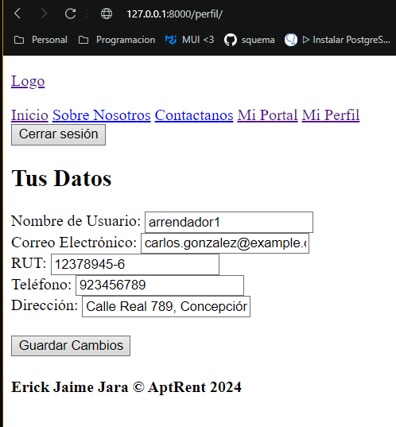
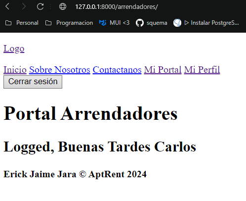
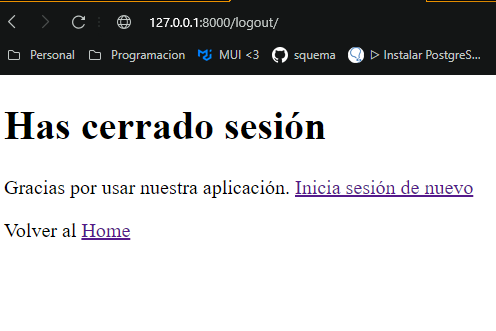
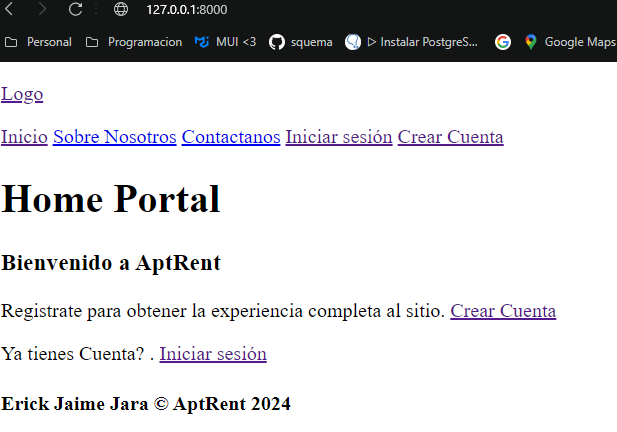

# Plataforma de Arrendamiento Inmobiliario
# Hito 2 - - Implementación de autenticación de usuarios usando django-auth

## Descripción

Este proyecto corresponde al Hito 3 del desafío de la plataforma de arrendamiento inmobiliario. Se han realizado diversas tareas para poblar la base de datos, consultar y generar reportes de inmuebles para arriendo, todo utilizando Django, migraciones y consultas SQL a través de scripts de Python.

## Requerimientos

- Django 5.1.3
- Python 3.12+
- PostgreSQL

## Funcionalidad en el Panel de vista web

1. **Iniciar Sesion**: Redirecciona a un form para poder ingresar las credenciales de acceso al sitio.
2. **Cerrar Sesion**: Eliminar del aplicativo la informacion sobre si existe un usuario conectado.
3. **Registrarse**: Usando los forms permitir el ingreso de un nuevo usuario definiendo su funcion y datos adicionales.
4. **Identificacion de Usuario**: En base al tipo de usuario es derivado a su portal 

## Pasos para la Instalación

1. **Clonar el Repositorio**:
   ```bash
   git clone <repositorio-url>
   cd <repositorio>

2. **Configuración de la Base de Datos**:

    - Crea la base de datos en PostgreSQL.
    - Configura DATABASES en settings.py.

3. **Migraciones**: 
    Ejecuta las migraciones para crear las tablas en la base de datos:

        ```bash
        python manage.py migrate

4. **Crear un Superusuario**: 
    Para acceder al panel de administración:

    ```bash
    python manage.py createsuperuser

5. **Iniciar el Servidor**: 
    Ejecuta el servidor de desarrollo de Django:

    ```bash
    python manage.py runserver

6. **Acceder al Panel de Admin**: 
    Visita http://127.0.0.1:8000/ para acceder e interectuar con los distintos operadores.


# Resumen de Implementaciones Realizadas

## 1. Modificacion de datos de perfil del Usuario:
Ahora cada usuario registrado podra modificar los datos personales asociado a su cuenta de usuario.

## 2. Modificacion vistas:
Se aplica vistas de forma modular para asi centrañlizar el uso del navbar y footer en cada pagina que visite el usuario ya sease registrado o no.

## 3. Clausulas y redireccionamiento
Se añaden condicionales segun el tipo de usuario y en caso de no existir un usuario e intente ingresar a enlaces no permitidos sera redirigido al homepage del aplicativo.


### Print de los resultados










Autor
Nombre: [Erick-Jaime-Jara]
Correo: [alucard.erick.mega@gmail.com]