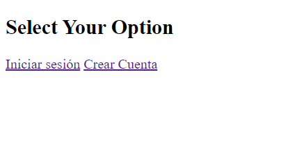
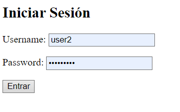
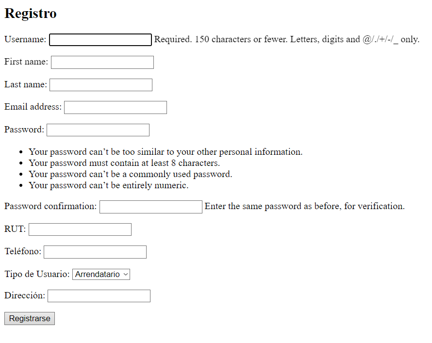
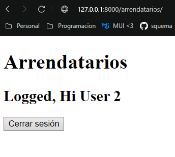
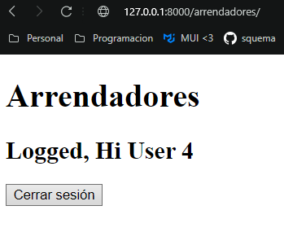
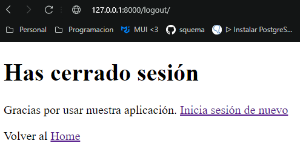

# Plataforma de Arrendamiento Inmobiliario
# Hito 2 - - Implementación de autenticación de usuarios usando django-auth

## Descripción

Este proyecto corresponde al Hito 2 del desafío de la plataforma de arrendamiento inmobiliario. El objetivo es crear un sistema de autenticación de usuarios, el cual permita a los usuarios registrarse, iniciar sesión
y cerrar sesión en el sitio web, así como gestionar permisos y grupos de usuarios.

## Requerimientos

- Django 5.1.3
- Python 3.12+
- PostgreSQL

## Funcionalidad en el Panel de vista web

1. **Iniciar Sesion**: Redirecciona a un form para poder ingresar las credenciales de acceso al sitio.
2. **Cerrar Sesion**: Eliminar del aplicativo la informacion sobre si existe un usuario conectado.
3. **Registrarse**: Usando los forms permitir el ingreso de un nuevo usuario definiendo su funcion y datos adicionales.
4. **Identificacion de Usuario**: En base al tipo de usuario es derivado a su portal 

## Pasos para la Instalación

1. **Clonar el Repositorio**:
   ```bash
   git clone <repositorio-url>
   cd <repositorio>

2. **Configuración de la Base de Datos**:

    - Crea la base de datos en PostgreSQL.
    - Configura DATABASES en settings.py.

3. **Migraciones**: 
    Ejecuta las migraciones para crear las tablas en la base de datos:

        ```bash
        python manage.py migrate

4. **Crear un Superusuario**: 
    Para acceder al panel de administración:

    ```bash
    python manage.py createsuperuser

5. **Iniciar el Servidor**: 
    Ejecuta el servidor de desarrollo de Django:

    ```bash
    python manage.py runserver

6. **Acceder al Panel de Admin**: 
    Visita http://127.0.0.1:8000/ para acceder e interectuar con los distintos operadores.


# Resumen de Cambios Implementados

## 1. Configuración de la Autenticación (3 puntos)
- **Configuración de aplicaciones necesarias**:
  - Aseguramos que `django.contrib.auth` y `django.contrib.contenttypes` están en `INSTALLED_APPS`.
- **URLs para autenticación**:
  - Configuramos las rutas necesarias para registro, inicio y cierre de sesión en el archivo `urls.py`.
- **Creación de superusuario**:
  - Generamos un superusuario para acceder al panel de administración utilizando el comando `python manage.py createsuperuser`.

---

## 2. Creación de la Vista y Formulario de Registro (3 puntos)
- **Vista de registro**:
  - Implementamos la vista `registro` utilizando un formulario personalizado basado en `UserCreationForm`.
- **Template HTML**:
  - Creamos el archivo `registro.html` con el formulario de registro estilizado con Bootstrap.
- **Registro de usuarios**:
  - Permite a los usuarios registrarse correctamente, integrando campos adicionales (`rut`, `telefono`, `direccion`, `user_type`) provenientes del modelo `UserProfile`.

---

## 3. Creación de las Vistas de Inicio y Cierre de Sesión (3 puntos)
- **Inicio de sesión**:
  - Implementamos la vista `LoginView` y configuramos el template `login.html` para mostrar el formulario de inicio de sesión.
- **Cierre de sesión**:
  - Configuramos la vista `LogoutView` y creamos el template `logged_out.html` para confirmar el cierre de sesión.
- **Validación**:
  - Verificamos que los usuarios puedan iniciar y cerrar sesión correctamente.

---

## 4. Gestión de Permisos y Grupos de Usuarios (1 punto)
- **Permisos personalizados**:
  - Asignamos permisos específicos a los usuarios mediante el campo `user_type` del modelo `UserProfile`.
  - Configuramos vistas protegidas con `@permission_required` y `@login_required` para restringir acceso según el tipo de usuario.
- **Grupos omitidos**:
  - En lugar de usar grupos, utilizamos lógica personalizada para validar los permisos basados en el tipo de usuario (`arrendatario` o `arrendador`).

---

## Otros Cambios Relevantes
- **Integración de lógica post-login**:
  - Los usuarios son redirigidos automáticamente según su tipo (`arrendatario` o `arrendador`) tras iniciar sesión.
- **Validaciones adicionales**:
  - Normalizamos y validamos el campo `rut` para evitar duplicados y errores de formato.
- **Ajustes en el modelo `UserProfile`**:
  - Modificamos el tamaño del campo `rut` en el modelo para soportar formatos con guiones.

---

## Conclusión

El sistema de autenticación y gestión de usuarios se implementó de forma exitosa, cumpliendo con todos los requerimientos del desafío. Se logró integrar un flujo de registro, inicio y cierre de sesión funcional, incluyendo la personalización del formulario de registro con campos adicionales del modelo `UserProfile`. Además, se configuraron permisos basados en el tipo de usuario (`arrendatario` o `arrendador`) para garantizar el acceso restringido a las vistas correspondientes. Con estas mejoras, el sistema proporciona una experiencia segura y adaptada a las necesidades específicas de los usuarios.


### Print de lo esperado














Autor
Nombre: [Erick-Jaime-Jara]
Correo: [alucard.erick.mega@gmail.com]