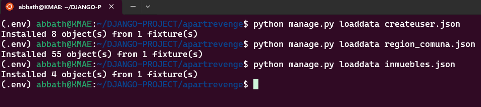
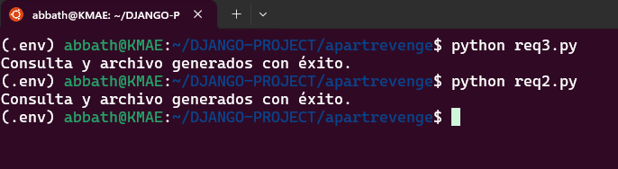
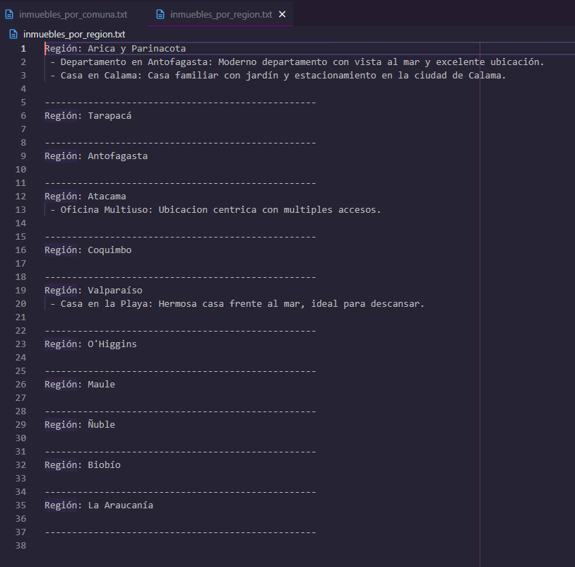
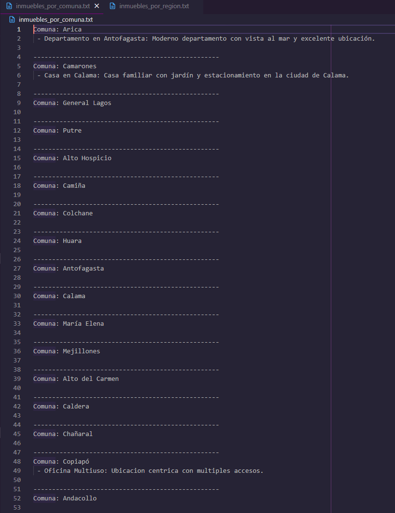

# Plataforma de Arrendamiento Inmobiliario
# Hito 2 - - Implementación de autenticación de usuarios usando django-auth

## Descripción

Este proyecto corresponde al Hito 3 del desafío de la plataforma de arrendamiento inmobiliario. Se han realizado diversas tareas para poblar la base de datos, consultar y generar reportes de inmuebles para arriendo, todo utilizando Django, migraciones y consultas SQL a través de scripts de Python.

## Requerimientos

- Django 5.1.3
- Python 3.12+
- PostgreSQL

## Funcionalidad en el Panel de vista web

1. **Iniciar Sesion**: Redirecciona a un form para poder ingresar las credenciales de acceso al sitio.
2. **Cerrar Sesion**: Eliminar del aplicativo la informacion sobre si existe un usuario conectado.
3. **Registrarse**: Usando los forms permitir el ingreso de un nuevo usuario definiendo su funcion y datos adicionales.
4. **Identificacion de Usuario**: En base al tipo de usuario es derivado a su portal 

## Pasos para la Instalación

1. **Clonar el Repositorio**:
   ```bash
   git clone <repositorio-url>
   cd <repositorio>

2. **Configuración de la Base de Datos**:

    - Crea la base de datos en PostgreSQL.
    - Configura DATABASES en settings.py.

3. **Migraciones**: 
    Ejecuta las migraciones para crear las tablas en la base de datos:

        ```bash
        python manage.py migrate

4. **Crear un Superusuario**: 
    Para acceder al panel de administración:

    ```bash
    python manage.py createsuperuser

5. **Iniciar el Servidor**: 
    Ejecuta el servidor de desarrollo de Django:

    ```bash
    python manage.py runserver

6. **Acceder al Panel de Admin**: 
    Visita http://127.0.0.1:8000/ para acceder e interectuar con los distintos operadores.


# Resumen de Implementaciones Realizadas

## 1. Población de la base de datos utilizando migraciones:
- **Regiones y Comunas de Chile**: Se utilizó `loaddata` para poblar la base de datos con las regiones y comunas de Chile. Se prepararon archivos JSON con los datos de las 16 regiones y sus correspondientes 4 comunas por cada una. Este proceso garantizó la correcta relación entre las entidades de `Region` y `Comuna`.
- **Tipos de Inmuebles**: Se poblaron los tipos de inmuebles disponibles en la base de datos, como `Casa`, `Departamento` y `Oficina`, utilizando `loaddata` para garantizar que los datos estuvieran correctamente cargados en el modelo `Inmueble`.
- **Inmuebles y Usuarios**: A través de `loaddata`, se cargaron varios inmuebles y usuarios en la base de datos, diferenciando entre `arrendatarios` y `arrendadores` a través de un modelo `UserProfile` que tiene una relación directa con el modelo `User` de Django.

## 2. Consultas de inmuebles para arriendo utilizando scripts Python:
- **Por Comuna**: Se desarrolló un script Python que, utilizando Django y SQL, consulta los inmuebles disponibles en cada comuna. Los resultados se guardaron en un archivo de texto con el nombre y la descripción de cada inmueble, separados por comuna.
- **Por Región**: De manera similar, se creó otro script para consultar los inmuebles por región. Los resultados se almacenaron en un archivo de texto con la misma estructura, pero esta vez los inmuebles fueron agrupados por la región a la que pertenecen.

## Conclusión

El proyecto fue exitosamente completado siguiendo los requerimientos establecidos. La utilización de migraciones y `loaddata` permitió poblar de manera eficiente la base de datos con las regiones, comunas, tipos de inmuebles y usuarios. Además, los scripts Python para consultar los inmuebles por comuna y por región han proporcionado una manera flexible y automatizada de generar reportes a partir de la base de datos. Estos procesos no solo optimizaron el manejo de la información en el sistema, sino que también demostraron la capacidad de integrarse con Django y SQL para realizar consultas avanzadas de manera sencilla.

El uso de Django junto con scripts de Python facilitó la automatización de tareas repetitivas, mejorando la eficiencia y reduciendo posibles errores manuales. Este enfoque refuerza las buenas prácticas de desarrollo en proyectos con bases de datos grandes y complejas.


### Print de lo esperado










Autor
Nombre: [Erick-Jaime-Jara]
Correo: [alucard.erick.mega@gmail.com]