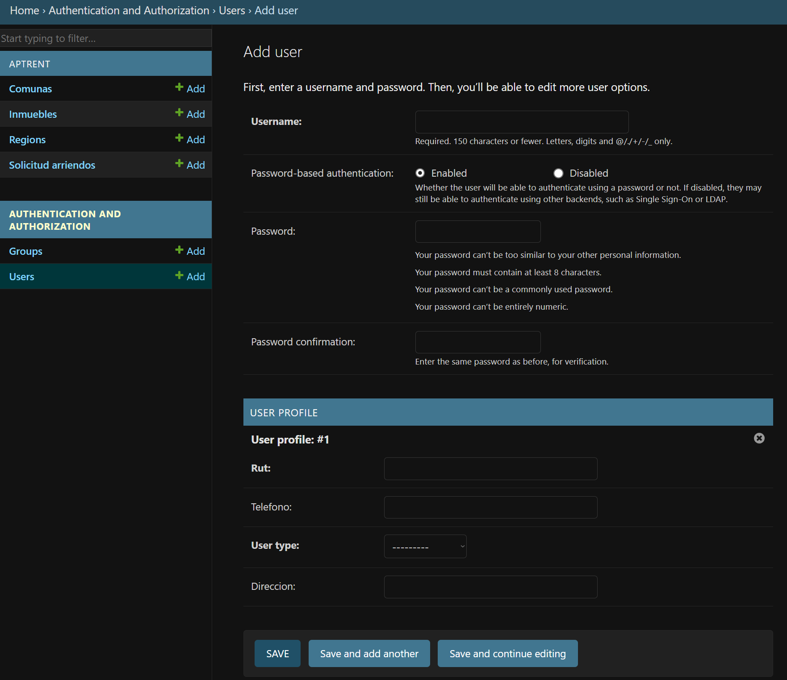
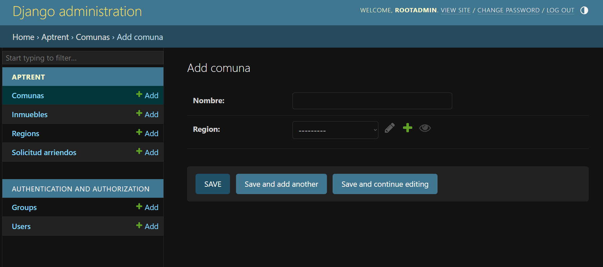
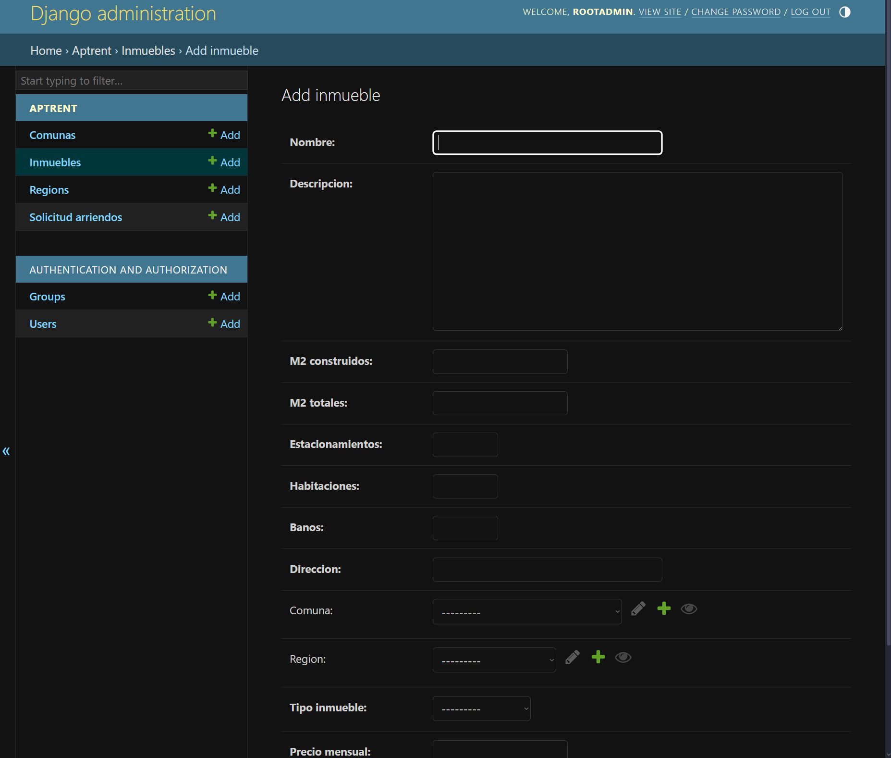
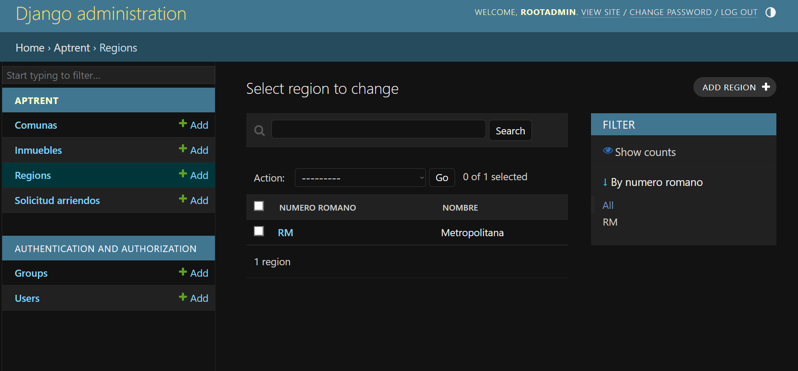
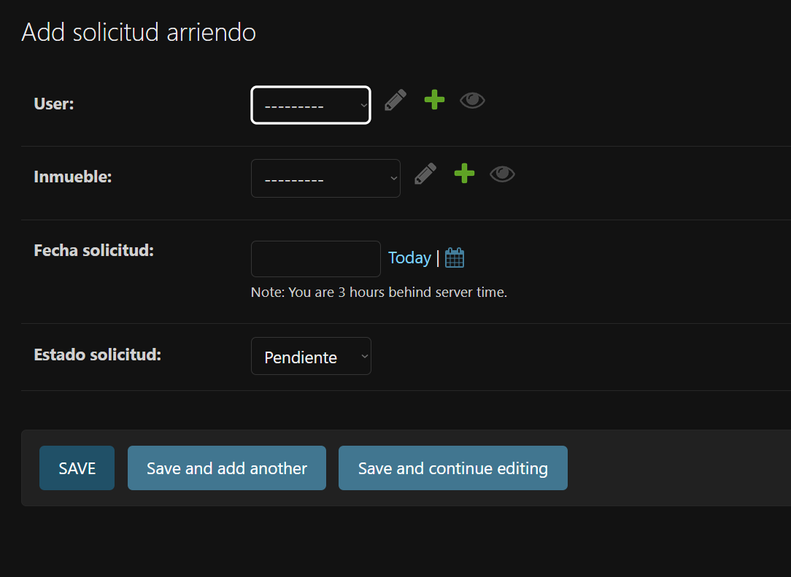

# Plataforma de Arrendamiento Inmobiliario
# Hito 2 - Configuración del Admin de Django

## Descripción

Este proyecto corresponde al Hito 2 del desafío de la plataforma de arrendamiento inmobiliario. El objetivo es realizar la creacion del super usuario con el comando `python manage.py createsuperuser` completando los campos que solicita la CLI.

## Requerimientos

- Django 5.1.3
- Python 3.12+
- PostgreSQL

## Estructura de Modelos

### Modelo `Regio y Comuna`
Se añaden los modelos de regiones y comunas para representar jerarquía geográfica cuya relacion de clave foránea en Comuna hacia Region.

### Modelo `Inmueble`
Ahora usa una relación de clave foránea hacia `Comuna` en lugar de un campo de texto plano para la `Comuna`.

### Modelo `SolicitudArriendo` (Sin Cambios)
Usa userprofile.user.get_full_name() en el método __str__ para mostrar nombre completo del usuario relacionado.


## Funcionalidad en el Panel de Admin

1. **Gestión de Inmuebles**: Permite agregar, editar y eliminar inmuebles disponibles para arriendo.
2. **Gestión de Perfiles de Usuario**: Los perfiles de usuario son creados en el mismo instante que cuando se crea un usuario desde el adminstrador de DJango.
3. **Solicitudes de Arriendo**: Segun el tipo de perfil permite realizar asignaciones de inmuebles y dejarlo en el estado deseado, por defecto siempre sera `Pendiente`.

## Pasos para la Instalación

1. **Clonar el Repositorio**:
   ```bash
   git clone <repositorio-url>
   cd <repositorio>

2. **Configuración de la Base de Datos**:

    - Crea la base de datos en PostgreSQL.
    - Configura DATABASES en settings.py.

3. **Migraciones**: 
    Ejecuta las migraciones para crear las tablas en la base de datos:

        ```bash
        python manage.py migrate

4. **Crear un Superusuario**: 
    Para acceder al panel de administración:

    ```bash
    python manage.py createsuperuser

5. **Iniciar el Servidor**: 
    Ejecuta el servidor de desarrollo de Django:

    ```bash
    python manage.py runserver

6. **Acceder al Panel de Admin**: 
    Visita http://127.0.0.1:8000/admin para gestionar los modelos de Inmueble, UserProfile y SolicitudArriendo.


## Proceso: Configuración del Panel de Administración
### Configuración Inicial del Panel de Administración

1. **Acceder al archivo admin.py**: Ubicado en la aplicación correspondiente (en este caso, por ejemplo, (aptrent/admin.py)

2. **Importar los Modelos**: Asegúrate de que todos los modelos a registrar estén importados correctamente. Por ejemplo:

    ```bash
    from django.contrib import admin
    from .models import Inmueble, Region, Comuna, SolicitudArriendo

3. **Registrar Modelos Básicos en el Admin Panel**: Utilizamos admin.site.register() para habilitar la visualización básica de los modelos en el panel de administración. Ejemplo inicial:

    ```bash
    admin.site.register(Inmueble)
    admin.site.register(Region)
    admin.site.register(Comuna)
    admin.site.register(SolicitudArriendo)

### Personalización de los Modelos en el Admin Panel

1. **Personalización del Modelo `Region`**

    ```bash
    class RegionAdmin(admin.ModelAdmin):
        list_display = ('numero_romano', 'nombre')
        search_fields = ('nombre', 'numero_romano')
        list_filter = ('numero_romano',)
    admin.site.register(Region, RegionAdmin)


2. **Personalización del Modelo `Comuna`**

    ```bash
    class ComunaAdmin(admin.ModelAdmin):
        list_display = ('nombre', 'region')
        search_fields = ('nombre', 'region__nombre')
        list_filter = ('region',)
    admin.site.register(Comuna, ComunaAdmin)


3. **Personalización del Modelo `Inmueble`**

    ```bash
    class InmuebleAdmin(admin.ModelAdmin):
        list_display = ('nombre', 'tipo_inmueble', 'region', 'comuna', 'precio_mensual')
        search_fields = ('nombre', 'descripcion', 'region__nombre', 'comuna__nombre')
        list_filter = ('tipo_inmueble', 'region', 'comuna', 'precio_mensual')
    admin.site.register(Inmueble, InmuebleAdmin)


4. **Personalización del Modelo `SolicitudArriendo`**

    ```bash
    class SolicitudArriendoAdmin(admin.ModelAdmin):
        list_display = ('id_solicitud', 'user__first_name', 'user__last_name', 'inmueble', 'fecha_solicitud', 'estado_solicitud')
        search_fields = ('user__first_name', 'user__last_name', 'inmueble__nombre', 'estado_solicitud')
        list_filter = ('estado_solicitud', 'fecha_solicitud')
    admin.site.register(SolicitudArriendo, SolicitudArriendoAdmin)

## Conclusion

    Podemos usar admin.site.register() habilita los modelos en el panel de administración.

    Los operadores list_display, search_fields, y list_filter personalizan y mejoran la experiencia del usuario para la gestión de datos.


### Print de lo esperado












Autor
Nombre: [Erick-Jaime-Jara]
Correo: [alucard.erick.mega@gmail.com]